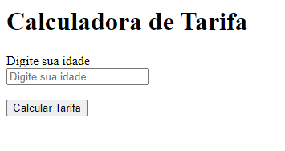

# Calculadora de Tarifa

  

Demonstração da tela

## Sobre

Este projeto é uma simples calculadora de tarifas que determina o valor a ser pago com base na idade do usuário. Ele foi desenvolvido em HTML e JavaScript.

## Funcionalidade

A calculadora oferece os seguintes recursos:

- **Entrada de Idade**: O usuário pode inserir sua idade em um campo de entrada.
- **Cálculo de Tarifa**: Ao clicar no botão "Calcular Tarifa", o sistema calcula o valor da tarifa de acordo com as seguintes regras:
  - Idades menores que 6 anos: Não pagam tarifa.
  - Idades entre 6 e 17 anos: Pagam 10% de desconto sobre a tarifa padrão de R$ 2,50.
  - Idades entre 18 e 59 anos: Pagam a tarifa padrão de R$ 2,50.
  - Idades acima de 59 anos: Pagam 30% de desconto sobre a tarifa padrão de R$ 2,50.

## Tecnologias Usadas

- HTML
- JavaScript
